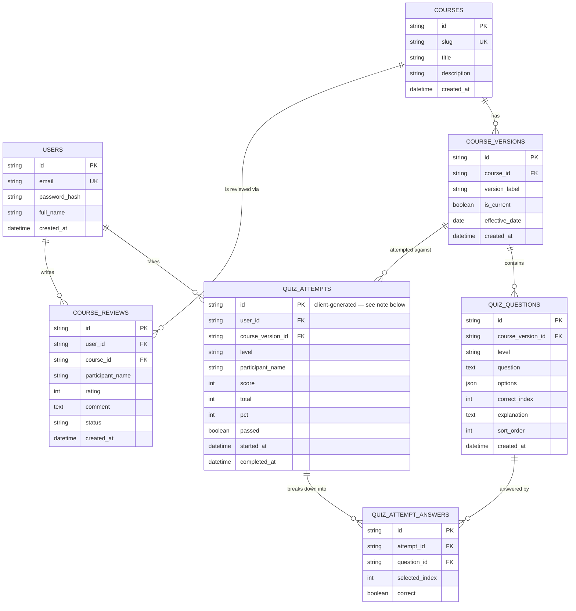

# Database Entity-Relationship Diagram

Every table this project's backend owns, and how they relate — generated
directly from the SQLAlchemy models in [`app/models.py`](app/models.py), not
drawn separately by hand. That matters for the same reason
[`tests/capture_backend_screenshots.py`](../tests/capture_backend_screenshots.py)
photographs the real running site instead of a mockup: a hand-drawn diagram
can silently drift out of sync with the actual schema the moment a column
changes, and nothing would ever say so. This one is checked against the real
models below.

GitHub renders the block above as an actual diagram wherever this file is
viewed on github.com — nothing to install or export separately.

## Notes that don't fit in a box

**IDs are plain strings, not a dedicated UUID column type.** Every `PK`/`FK`
above is a `String(36)` holding a UUID's canonical text form, not
SQLAlchemy's own `Uuid` type. That type expects real `uuid.UUID` Python
objects and broke the moment a plain string reached it (this project's own
fixed seed IDs, for one) — see the comment at the top of `app/models.py` for
the full story. Functionally this changes nothing; every id is still
globally unique and still validated as a real UUID at the API boundary by
Pydantic (`app/schemas.py`) — only the database column's own type is
simpler than the "obvious" choice.

**`QUIZ_ATTEMPTS.id` is usually chosen by the browser, not the database.**
`quiz.js` generates it via `crypto.randomUUID()` the moment the quiz starts,
specifically so a certificate can display a real, working Certificate ID
the instant someone passes — before the save to this table has even begun,
let alone finished. `POST /attempts` accepts that id rather than generating
its own. See the long comment on `quizState.attemptId` in `quiz.js`.

**`QUIZ_ATTEMPT_ANSWERS` exists but nothing writes to it yet.** Modelled for
parity with the original design (and to leave room for a future "review your
answers" feature) but deliberately left unwired — grading has always
happened entirely client-side in `quiz.js`, and only the final score is
saved today.

**No foreign key back from `COURSE_REVIEWS`/`QUIZ_ATTEMPTS` enforces "one
course" as a business rule** — `course_id` and `course_version_id` are real,
enforced foreign keys, but the schema itself allows any number of courses
and versions. Right now exactly one of each exists (seeded by
[`seed.py`](seed.py)); the shape was kept general on purpose, the same
reasoning `supabase/schema.sql`'s own comments gave for the equivalent
tables before this backend replaced it.

**Row Level Security is gone, and that is a real trade-off, not a wash.**
The Supabase-era schema (`supabase/schema.sql`) enforced "a user may only
read their own attempts" as a database policy — impossible to bypass even
by a buggy query. This backend enforces the same rule in Python instead
(every route in `app/routers/` that touches another user's data filters
explicitly by `current_user.id`), which works, but means each route has to
get its own filtering right rather than being unable to get it wrong. See
the comment at the top of `app/models.py` for the full reasoning.
